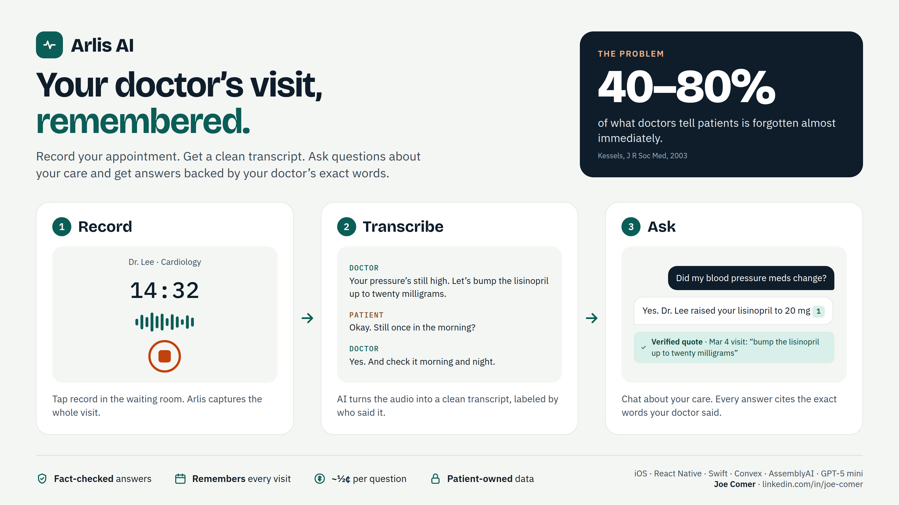

# Arlis AI

**Arlis is an iOS app that records your doctor's visits and lets you ask questions about your care.** Every answer quotes the exact words your doctor said, and each quote is checked against the real transcript before you see it.

| | |
|---|---|
| **Problem** | Patients forget 40–80% of what their doctor tells them ([Kessels, 2003](https://pmc.ncbi.nlm.nih.gov/articles/PMC539473/)). |
| **Solution** | Record → AI transcript labeled by speaker → chat that cites your own visits. |
| **Also** | Appointment prep, quick questions for your next visit, medication calendar. |
| **Stack** | React Native + Swift · Convex · AssemblyAI · GPT-5 mini · Stripe |
| **Status** | <!-- TODO: e.g. "In development", "TestFlight beta", "Live on the App Store" --> In active development |

### Want the details?
- [How the system fits together](docs/architecture.md)
- [How the AI keeps answers accurate, safe, and cheap](docs/ai-pipeline.md)
- [How it's built so fast](docs/engineering.md)

---

Built by **Joe Comer**, **Jonah Elliott**, and **Evan Pursley** · [Joe Comer - LinkedIn](https://www.linkedin.com/in/joe-comer) [Jonah Elliott - LinkedIn](https://www.linkedin.com/in/jonah-elliott-87771024a/) [Evan Pursley - LinkedIn](https://www.linkedin.com/in/evan-pursley-25b551353/)

© Aleris Medical Systems, LLC. All rights reserved. This repository contains documentation only; no product source code is included or licensed.
