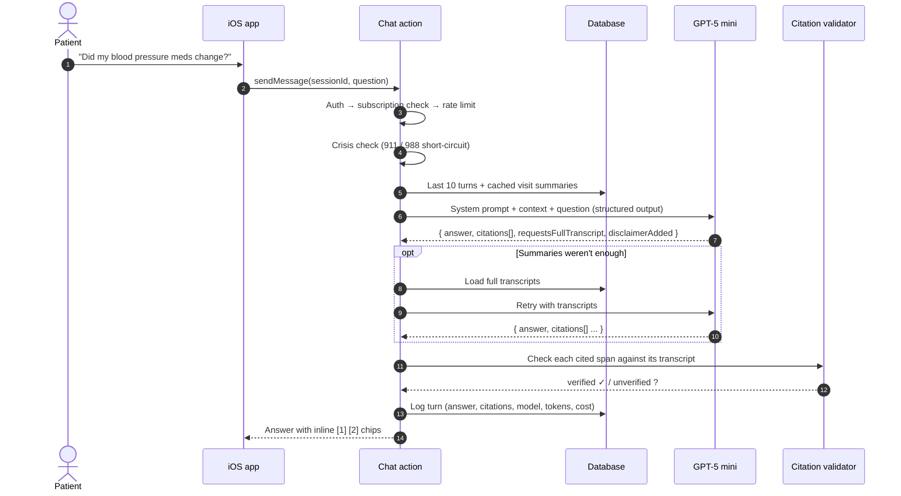
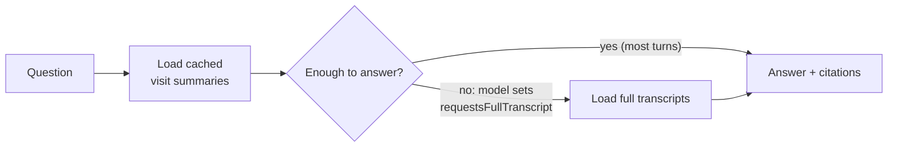
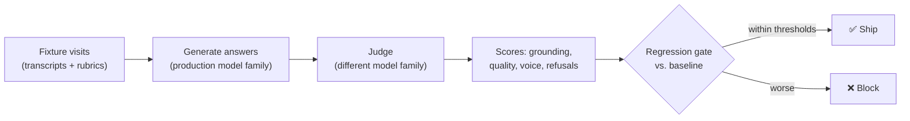

# AI pipeline

[← Back to overview](../README.md)

A medical chatbot has to clear three bars at once:

1. **Grounded.** It must never invent what your doctor said.
2. **Safe and useful.** It has to be careful without dodging every question.
3. **Cheap enough for a $9.99/month consumer app.**

Here's how Arlis meets each one.

## One chat turn, end to end



## Grounding: answers you can check

The model doesn't answer in free text. It returns a **structured object**:

```json
{
  "answer": "Yes — Dr. Lee increased your lisinopril to 20 mg [1] and asked you to log readings twice a day [2].",
  "citations": [
    { "visitId": "…", "span": "let's bump the lisinopril up to twenty milligrams" },
    { "visitId": "…", "span": "check it morning and night and write it down" }
  ],
  "requestsFullTranscript": false,
  "disclaimerAdded": false
}
```

After generation, a **citation validator** exact-matches every `span` against the named visit's transcript. Each citation gets a verified flag, shown in the UI as ✓ or ?. The model can't quietly make up a quote.

## Cost: summaries first, transcripts on demand



- Each visit gets a **key-points summary** the first time it's opened. It's generated once and cached. Points are grouped (medication, diagnosis, vitals/labs, plan/follow-up, patient concern), and each comes with a verified verbatim span.
- Chat sends these compact summaries first and escalates to full transcripts only when the model asks for them.
- Result: about **$0.005 per chat turn** on average. Every turn's token count and cost is logged, so spend is measurable.

## Safety posture

| Situation | Behavior |
|---|---|
| Normal question about your visits | Answer with citations |
| Clinical-adjacent ("Should I be worried about…?") | Answer what the transcripts say, add a gentle *"you might want to ask your doctor"* — **disclaim, don't refuse** |
| Crisis language | **Hard stop.** Route to 911 / 988. The only hard refusal. |
| Off-topic or abuse | Rate limits plus a fixed set of 8 refusal reasons, logged per turn |

The "disclaim, don't refuse" choice was deliberate. Earlier versions layered on more guardrails (output regex filters, drift counters, hard caps), and they made the assistant evasive about the patient's *own* visit. Those layers were retired from production. Answer tone is now defended in the eval harness, where it can be measured, instead of with brittle runtime filters.

## Memory

- **Within a conversation:** the last 10 turns.
- **Across visits:** the assistant sees summaries of *all* your visits from the very first session, so it can answer questions like "how has my treatment changed since January?"
- **Across conversations:** no hidden memory. Each chat session starts clean, which keeps behavior predictable and auditable.

## Measuring quality



- **Generate with one model family, judge with another.** Same-family judging tends to inflate scores, so the judge comes from a different provider.
- Graders cover **grounding** (are citations real and relevant?), **quality**, **voice/tone**, and **refusal correctness**.
- A **baseline + threshold** gate means prompt changes are measured before they ship, not guessed at.
