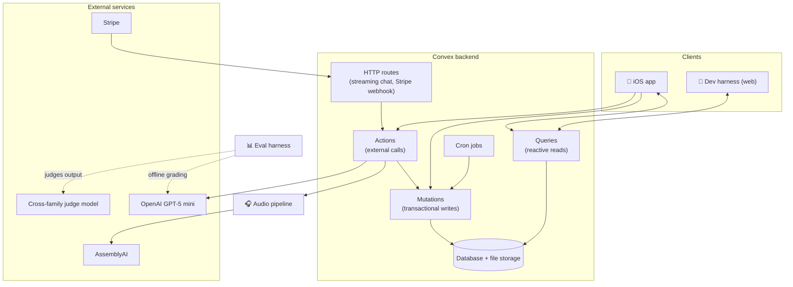
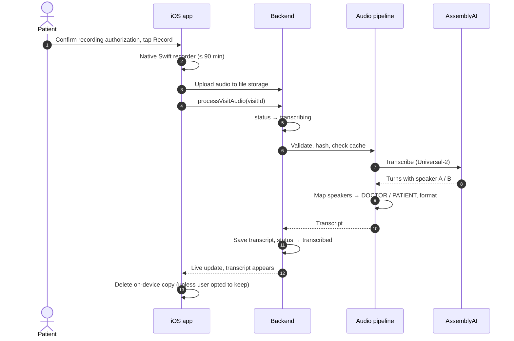
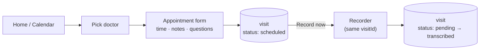
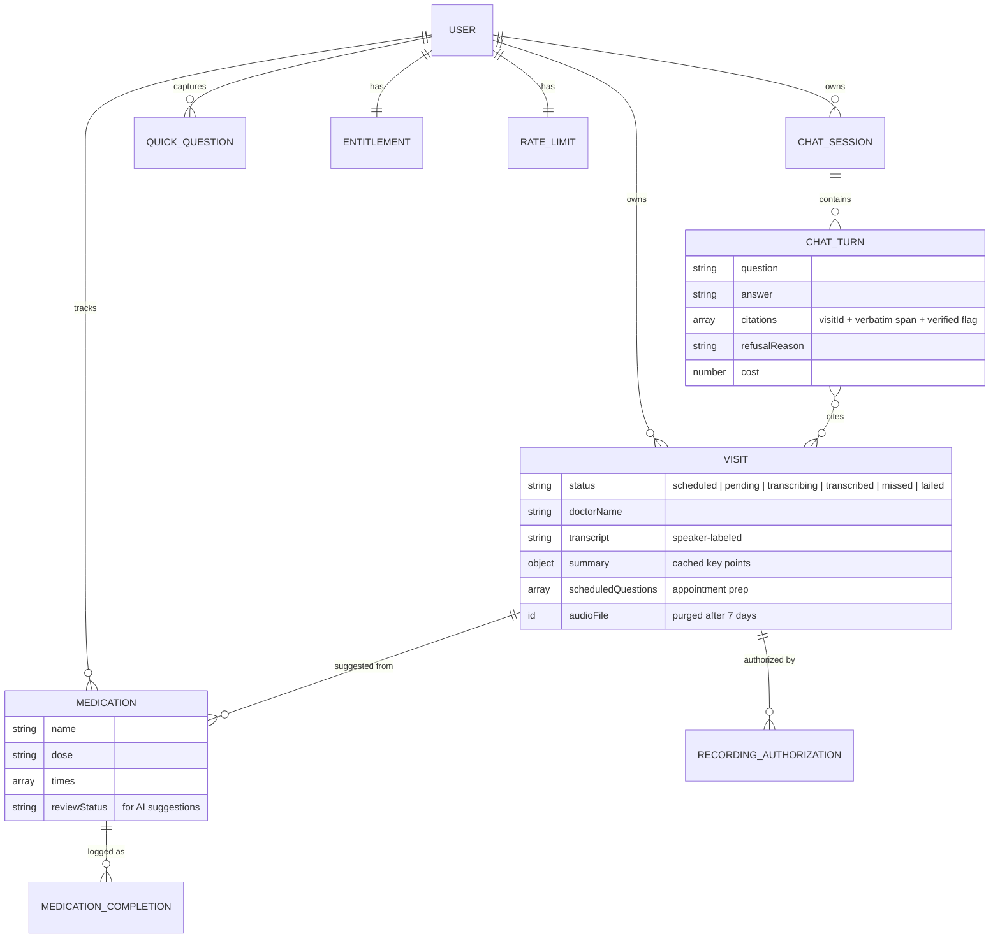

# Architecture

[← Back to overview](../README.md)

Arlis is a TypeScript monorepo with five packages and a marketing site:

| Package | Role |
|---|---|
| **Mobile app** | The product. Expo + React Native, iOS-first, with a custom Swift module for recording. |
| **Backend** | Convex: schema, server functions, HTTP routes, scheduled jobs, auth, billing. |
| **Audio pipeline** | Audio → speaker-labeled transcript. Usable as a library from the backend or as a CLI. |
| **Eval harness** | Offline grading of AI output quality, with a regression gate. Never in the request path. |
| **Dev harness** | A throwaway web UI for exercising the backend during development. Not shipped. |

## System map

**Why Convex?** It's the database, the server functions, and the realtime sync layer in one place. The app subscribes to queries and re-renders the moment data changes. When a transcript finishes, the visit screen updates by itself, with no polling and no hand-written REST API.

## Request paths

### 1. Recording → transcript

- **Recording authorization** is captured on *every* recording attempt and stored as an append-only record.
- **Content-hash caching**: the pipeline keys results by the audio's SHA-256, so reprocessing the same file costs nothing.
- **Self-healing**: a watchdog job flips any visit stuck in `transcribing` for more than 30 minutes to `failed`, which unblocks retry.

### 2. Question → grounded answer

See [AI pipeline](ai-pipeline.md) for the full breakdown.

### 3. Appointment → recording

An appointment isn't a separate object. It's a visit in `scheduled` status. When you record, the audio attaches to that same row, so your prepared questions, the recording, and the transcript stay together.

## Data model

Everything hangs off one central object: the **visit**. Every row is owned by an authenticated user.

Design rules:
- **Soft delete everywhere.** Deleted visits stay addressable so old chat citations never break.
- **Every chat turn is logged**: question, loaded visits, raw and final answer, per-citation verification, model, token count, cost. That gives a full audit trail and per-turn cost visibility.
- **Idempotent writes**: client-generated IDs prevent duplicate visits on flaky networks, and the Stripe webhook log drops duplicate or out-of-order events.

## Background jobs

| Job | Frequency | What it does |
|---|---|---|
| Purge audio | Daily | Deletes server audio older than 7 days, in bounded batches that reschedule themselves |
| Transcription watchdog | Every 5 min | Marks visits stuck in `transcribing` for more than 30 min as `failed` |
| Missed appointments | Daily | Marks past-due `scheduled` visits as `missed` after a 1-day grace period |

## Auth & billing

- **Sign-in:** Sign in with Apple (native), Google OAuth, or email + password.
- **Subscription:** Stripe Checkout. A webhook updates the user's entitlement, and paid features check it server-side before running.
- **Rate limits:** per-user burst and daily caps on chat to protect against abuse and runaway cost.
