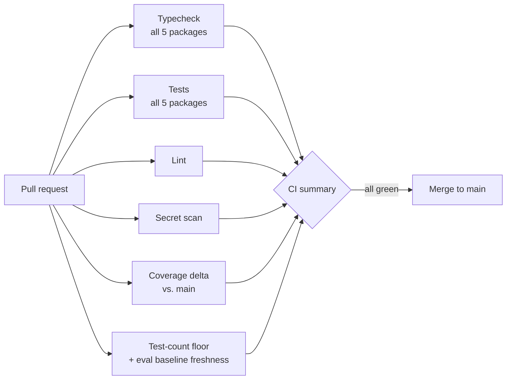
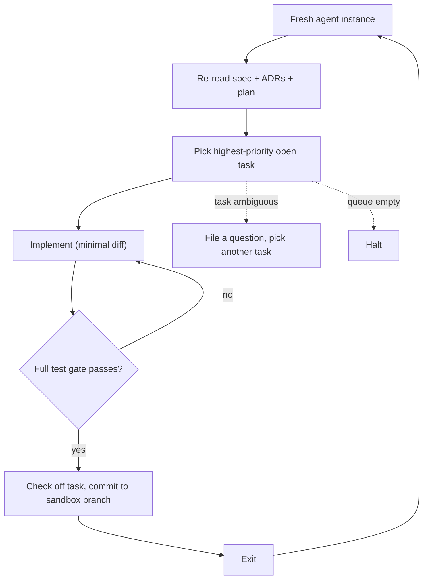

# Engineering practices

[← Back to overview](../README.md)

Arlis is built by a very small team moving fast with AI-accelerated development. The practices below keep that speed from turning into chaos.

## Decisions are written down first

Every real architectural choice is recorded as a numbered **Architecture Decision Record (ADR)** before it's built. There are 25+ so far, covering the chat output contract, the safety posture, audio retention, and why appointments share the visits table. Each ADR has the same shape: *Context · Decision · Consequences · Rejected alternatives.*

ADRs are binding. If code disagrees with an ADR, either the code gets fixed or a new ADR supersedes the old one. Nothing drifts silently.

## Quality gates on every change

- **Typecheck and test every package**, not just the one you touched. Changing a shared type, like adding a new visit status, has to compile everywhere.
- **Coverage can't drop** more than a small threshold versus `main`, and the **test count can't shrink**.
- **Secret scanning** on every PR.
- **Backend tests run against the real schema**, not a mocked database.
- **Eval baseline freshness**: CI fails if the AI-quality baseline gets stale.

## AI-accelerated development

Development runs partly through an **autonomous coding loop**: an AI agent that works through a checklist of planned tasks without supervision.

The key idea is that **state lives in git, not in the model's memory**. Each iteration starts blank and re-reads the spec, decisions, and plan from disk. Guardrails keep it safe to run unattended:

- It only commits to a sandbox branch and never touches `main` or pushes. A human reviews and merges.
- It must pass the same test gate as a human contributor.
- It halts when the task queue is empty, so it can't invent its own busywork.
- Each run has a hard iteration cap to bound the blast radius.

That combination of written decisions, a strict test gate, and an autonomous loop is how a small team can ship a production-grade mobile app, backend, and AI pipeline quickly.

## Privacy & data handling

- **Recording authorization** is captured on every recording attempt.
- **Raw audio is deleted from the server after 7 days**, and on-device copies are deleted after upload unless the user chooses to keep them.
- **Every row is scoped to its owner** and checked server-side on every request.
- **Privileged actions are written to an append-only audit log.**
